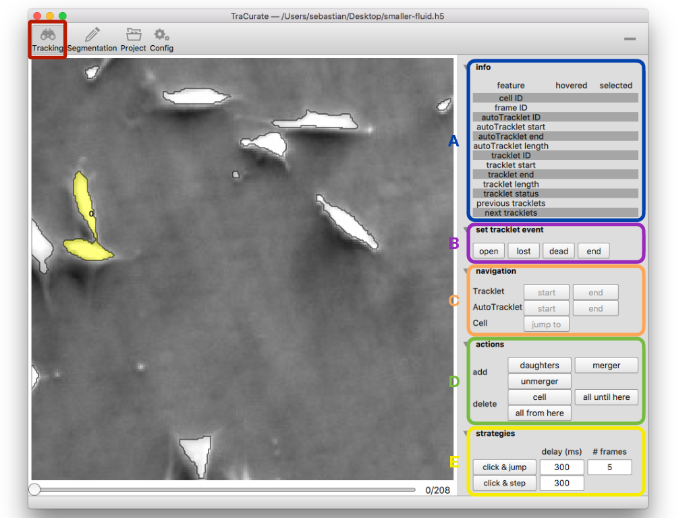
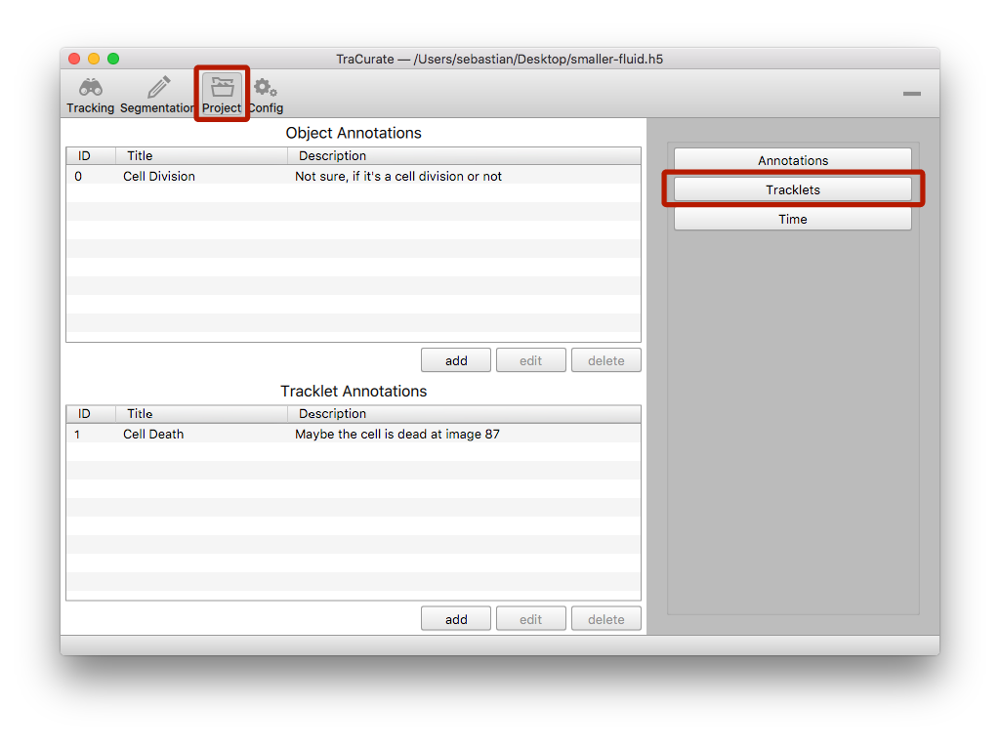
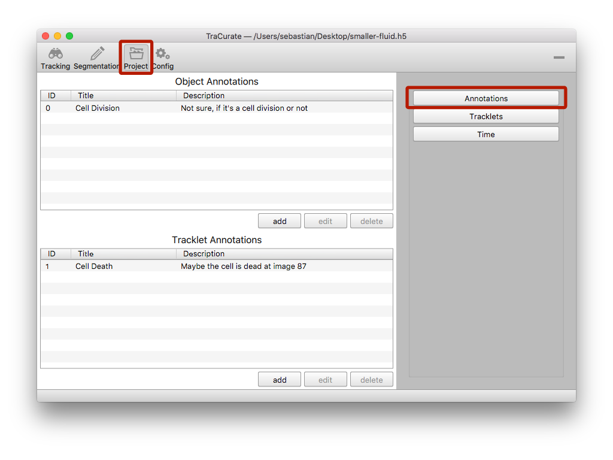
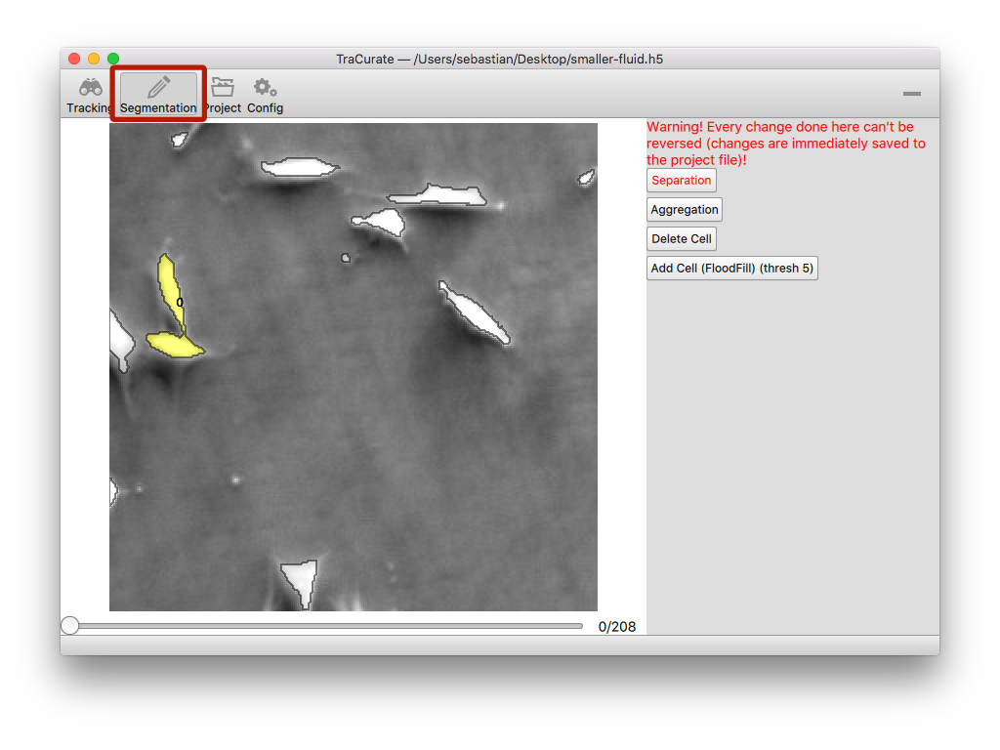
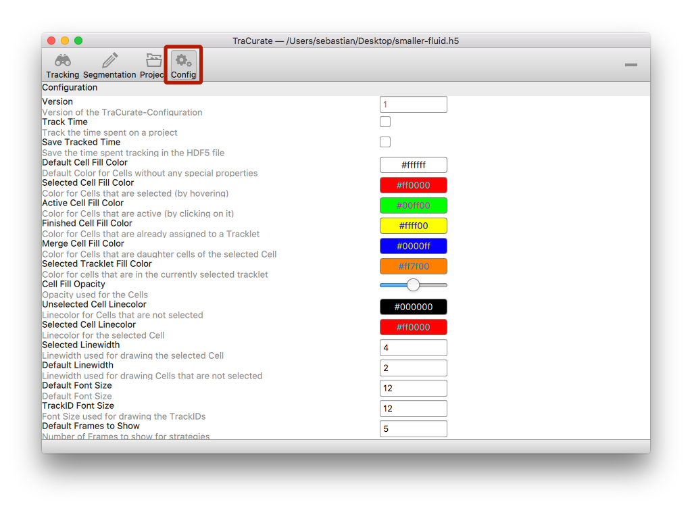
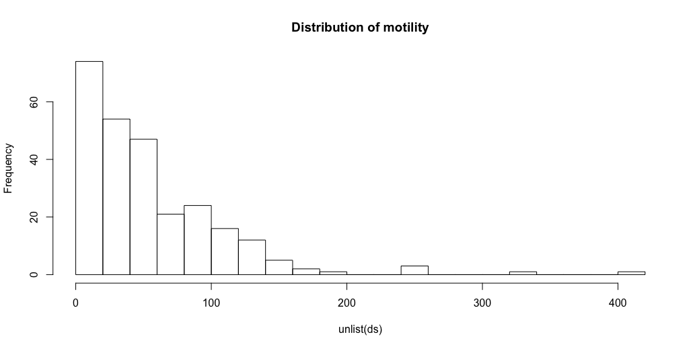
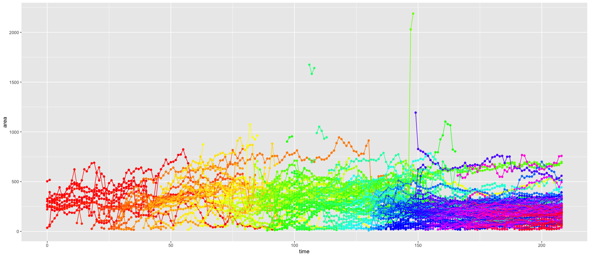

# User Manual TraCurate

[TOC]


## General

### Loading

Load a tracking file via ```File -> Open project```. TraCurate only accepts HDF5 files. After selecting the file, a status window will be opened and you can follow the loading progress.

### Tracklets

The goal of TraCurate is to aid the curation of tracklets. A tracklet describes the course of a single cell over time (i.e. over several frames in the movie). Multiple tracklets can be combined using so called events. For example, if a cell divides in a certain frame, the course of the cell up to that frame is a single tracklet. The courses of the two daughter cells, from the next frame on, are also individual tracklets. The three tracklets are then connected via a “division” event.

### Autotracklets

The HDF5 files used by TraCurate contain information about tracklets that were automatically generated. Throughout TraCurate and its documentation these tracklets are refered to as  "autotracklets".
 
## Views

### View: Tracking

The tracking view is where you will spend most of your time. It provides means for inspecting cells and autotracklets as well as modifying tracklets.



#### Hovered/Selected cell
Many of TraCurate’s functions require the user to select cells. The tracking view contains general information (A) about the cell that is currently selected and the cell that the mouse pointer hovers over, such as the length of the (auto)tracklet, start and end frame and relevant IDs.

#### Navigation
To navigate through the movie you can either click the navigation buttons (C) on the right side, use the frame slider at the bottom, or use a number of shortcuts (on Linux, replace ```Cmd``` by ```Ctrl```):

| Shortcut        | Description                                                  |
| --------------- | ------------------------------------------------------------ |
| ```s```/```d``` | Go one frame back or forth                                   |
| ```a```/```f``` | Go five frames back or forth                                 |
| ```q```/```r``` | Go to the start or end of the selected autotracklet          |
| ```w```/```e``` | Go to the start or end of the selected tracklet              |
| ```Cmd+N```     | Switch to view ```N```:<br />  - ```1```: Tracking view<br />  - ```2```: Segmentation view<br />  - ```3```: Project view<br />  - ```4```: Configuration view |
| ```Cmd+o```     | Open a project                                               |
| ```Cmd+s```     | Save the current project                                     |
| ```Cmd+d```     | Show/hide object outlines                                    |
| ```Cmd+t```     | Show/hide trackletIDs                                        |
| ```Cmd+a```     | Show/hide information about annotations                      |
| ```Cmd+"+"```   | Zoom in                                                      |
| ```Cmd+"-"```   | Zoom out                                                     |
| ```Cmd+0```     | Reset the zoom                                               |
| ```Space```     | Pause / Assignment                                           |

#### Create a new tracklet
Click at the cell you want to track. After clicking, you have to press the space key to set an unused trackletID. You can now navigate through the movie by pressing “d” and follow the suggested autotracklet that is coloured in orange. To confirm the autotracklet, navigate to its end, hover the mouse pointer over it and press the space bar. To ensure a correct assignment, you can either look into the information table on the right side (A), or press “s” to go back and see the trackletID right over the cell.
If the autotracklet contains a wrong assignment, go to the last frame that is correct, hover the pointer over it and confirm with the space bar. Then go to the next frame, hover the pointer over the correct cell and press the space bar. This now leads to the assignment of a new autotracklet you can follow further.

Alternatively to navigating through the movie with the shortcuts, you have the following options (E):

| Strategy     | Description                                                  |
| ------------ | ------------------------------------------------------------ |
| Click & Step | After clicking into a cell mask, the tool automatically moves through the movie and the autotracklet can be followed. It automatically stops at the end of the autotracklet. Alternatively you can stop it at any frame by pressing the space bar. The speed of the transition between two images can be chosen next to the button. |
| Click & Jump | After clicking on a cell mask the program jumps to the end of the autotracklet. With this strategy, you can connect disconnected autotracklets in a very fast way. |

If there are clustering cells or other opaque situations, it is easier to track manually with the space key. Please consider, that there is a possibility to hide the object outlines (Cmd+d) to have a better view on what is going on. Sometimes also the prior movement direction of a cell is very useful in case of determining the same cell over time.

#### Remove parts of the tracklet (D)
Cell tracklets can be partially removed if they were assigned wrongly. There are three possibilities: (i) only a cell object at a single time point is removed (“delete cell”); (ii) all cell objects before the current one are removed (“delete all until here”) or (iii) all cell objects starting from the current one are removed (“delete all from here”). 

#### Cell division (D)
If a cell divides into two, (i) track this mother cell until the last time point before division and press the space key. (ii) Now keep the mother cell selected and activate the button “add daughters”. Press “d” to see the daughter cells in the next frame and click on them. New tracklets for the daughter cells will automatically be generated if they don’t exist already. If you wrongly assigned a daughter tracklet, simply click on it again. When finished, unclick the “add daughters” button. Continue with tracking the daughter cells after selecting them.

#### Select status (B)
The default state is “open”. Once you finished a tracklet, change the status to “dead”, “lost” (if a cell moves out of the image and does not come back or if cells cannot be distinguished) or “end of movie” (this status is assigned automatically to each tracklet reaching the end of the movie). The tracklet status “cell division” is assigned automatically to the mother cell, if daughter cells are added.

#### Save project
You can save the project with Cmd + s. It is advisable to frequently do that to prevent data loss in case of an unexpected programme termination.  

### View: Project


Here you have three options:

  1. To get an overview of the tracklets, click “tracklets” on the right side of the window. You can see track information, mother and daughter tracklet-IDs, tracklet annotations and the current status. Use the possibility to order the table by clicking on the table headers. If you double-click a row, the program jumps to the starting point of the chosen tracklet.
    
  2. If you click the “annotation” button on the right side, you can leave some helpful hints for analysis. Often it is used if something unusual has happened, or you do not know how to track a particular situation. Object annotations are used for adding information of a cell at one particular time point. Tracklet annotations are valid for the whole tracklet.
    
    Anotations are done in two steps:
      1. First you have to create the annotation by
        - Switching to the project view
        - Clicking “Annotations”
        - Clicking “add” (either for object or tracklet annotations)
        - Fill the form
        - Click “ok”
      2. Once you created an annotation, switch back to tracking view
        - Right-clicking on an object brings up a context menu
        - You can either assign
          - an object annotation to the object you just right-clicked on or
          - a tracklet annotation to the tracklet of the object you right-clicked on
  3. If enabled by the user in the Config View, TraCurate can track the time spent working on a movie. In case this feature is turned on, clicking on "time" will give you an overview of the time invested in the current movie. The recorded times will be saved in the HDF5 file when saving the project.


#### Annotations
### View: Segmentation

This view provides you with tools to create, delete, or change the outlines of cells in the movie. Please be aware, that as soon as you confirm any of the actions in this view, they will be irrevocably written to the HDF5 file and can only be undone by using a backup of the HDF5 file.


#### Separation
This function allows you to split an outline into two. This is useful in cases, where there are two cells but the automatic segmentation only created one outline. To use this function, drag your mouse while holding the left mouse button pressed. A line will appear at which the outline will be divided. When you release the mouse button, you can preview the resulting separation of the outline. To confirm this separation, just press the space bar. If you want to try the separation again, just drag your mouse pointer from a different point without confirming the separation via the space bar.

#### Aggregation
Sometimes, the automatic segmentation splits a cell’s outline into two, though it should only be a single outline. To fix this, just left click the two parts of the outline. After this, you can preview the resulting combined outline. If you want to write this change, just confirm with the space bar, otherwise start again by choosing two cells.

#### Delete cell
If the automatic segmentation created an outline, where there is no cell, you can delete it. Just select the outline you wish to delete and confirm with the space bar.

#### Add cell
In case the outline of a cell was not detected, you can create it manually using the flood fill algorithm. To use it, select “Add Cell (FloodFill) (thresh X)” from the sidebar. Then, click in the middle of the cell and preview the resulting outline. The threshold (thresh) defines how much pixels might differ from the selected point to still be considered inside the outline. Its value can be changed using the mouse wheel. So if you increase this value, the area of the outline should increase. To create the new cell, confirm with the space bar. Note: this algorithm is quite CPU-intensive. There are safeguards to avoid a lockup of the program, which can be altered in the config view. Only change these values, if you absolutely know what you are doing.
 
### View: Config

Here you can change the settings of the programme for a better visualisation, i.e. if you have a very bright movie, you might want to change to darker colours.


| Configuration name           | Description                                                  |
| ---------------------------- | ------------------------------------------------------------ |
| Version                      | Version of TraCurate's HDF5-Format that is supported by this application (not configurable) |
| Track Time                   | Whether TraCurate should track the time spent on editing a project |
| Save Tracked Time            | Wheter the tracked time should be stored in the HDF5 file when saving the project |
| Default Cell Fill Color      | The default color used for filling the outlines of cells when no special property for the cell is active |
| Selected Cell Fill Color     | The color used to fill the outline of a cell when it is selected by hovering over the cell |
| Active Cell Fill Color       | The color used to fill the outline of a cell that is active, i.e. it was clicked on |
| Finished Cell Fill Color     | The color used for filling the outlines of cells of a tracklet that spans until the end of a movie, so the user can easily distinguish which tracks still need work |
| Merge Cell Fill Color        | The color used for filling the outlines of daughter cells of the cell that is currently active |
| Selected Tracklet Fill Color | The color used for filling the outlines of cells that belong to the same tracklet as the currently selected cell |
| Cell Fill Opacity | The opacity used for filling the outlines of cells. In darker images it might be beneficial to decrease this value |
| Unselected Linewidth | The width of the line used to draw cells that are not selected/active |
| Selected Linewidth | The width of the line used to draw cells that are selected/active |
| Default Font Size | The default font size used within the application |
| TrackID Font Size | The font size used to write the trackID |
| Default Frames to Show | The default number of frames that is shown at the end of the selected autotracklet when using the Click & Jump strategy. This can still be changed in the settings for the strategy |
| Default Frame Delay | The default delay between individual frames when showing a series of frames. This applies to the Click & Jump Strategy as well as the Click & Step strategy |
| Scroll Factor on X-Axis | How many pixels are scrolled on a single keypress on the x-axis |
| Scroll Factor on Y-Axis | How many pixels are scrolled on a single keypress on the y-axis |
| TrackID Color | The color used to write the TrackID. It might be beneficial to select a brighter color here when working on dark images |
| Maximum Pixelmask Percentage | The maximum percentage of all pixels to consider when using the FloodFill algortihm in the Segmentation View |

## Tools

### tcimport
To import data from TraCurate's HDF5 file format into R, the ```tcimport``` package was created. The following shows a description of the installation and usage of the package.

#### Installation

To install ```tcimport```, simply run the following command:

```{R}
devtools::install_gitlab("tracurate/tcimport")
```

#### Commands

- ```read_annotations``` reads the annotations from the given HDF5 file.

  ```{R}
  > tcimport::read_annotations(fn)
  $object_annotations
  $object_annotations[[1]]
  $object_annotations[[1]]$object_annotation_id
  [1] 0
  $object_annotations[[1]]$title
  [1] "Test object annotation title"
  $object_annotations[[1]]$description
  [1] "Test object annotation description"
  $track_annotations
  $track_annotations[[1]]
  $track_annotations[[1]]$track_annotation_id
  [1] 1
  $track_annotations[[1]]$title
  [1] "Test tracklet annotation title"
  $track_annotations[[1]]$description
  [1] "Test tracklet annotation description"
  ```

  

- ``` read_dimensions``` reads the dimension of an image from the given HDF5 file. The data format is constructed such that each slice in a frame can have arbitrary dimensions. But in principle image dimensions are likely to be the same over all frames and slices.
  
  ```{R}
  > tcimport::read_dimensions(fn, 0, 0)
  [1] 250 250
  ```
  
- ```read_events``` reads the events from the given HDF5 file.
  
  ```{R}
  > tcimport::read_events(fn)
  $`5`
  $`5`$event_id
  [1] 5
  
  $`5`$name
  [1] "end_of_movie"
  
  $`5`$description
  [1] "The cell track ends at the end of the movie."
  [...]
  ```
  
- ```read_image_by_id``` reads an image from the given HDF5 file.
  
  ```{R}
  > tcimport::read_image_by_id(fn, 0, 0, 0, as.matrix = TRUE)
         [,1] [,2] [,3] [,4] [,5] [,6] [,7] [,8] [,9] [,10]
    [1,]  101  102  104  105  108  111  111  109  108   108
    [2,]  104  105  103  104  106  110  111  110  110   110
    [3,]  106  106  105  104  105  109  111  112  111   111
    [4,]  105  105  108  107  106  108  110  112  111   110
         [,11] [,12] [,13] [,14] [,15] [,16] [,17] [,18] [,19]
    [1,]   111   110   112   113   112   114   114   112   113
    [2,]   108   107   108   110   111   113   113   111   112
  [...]
  ```
  
- ```read_image_by_path``` reads an image from the given HDF5 file.
  
  ```{R}
  tcimport::read_image_by_path(fn, "/images/frames/0/slices/0/channels/0")
  ```
  
- ```read_object_by_id``` reads the objects features for the specified object from the given hdf5 file .
  
  ```{R}
  > tcimport::read_object_by_id(fn, 0, 0, 0, 0)
  $annotations
  [1] NA
  
  $bounding_box
       [,1] [,2]
  [1,]   88  107
  [2,]    0   26
  
  $centroid
  [1] 98 16
  
  $channel_id
  [1] 0
  
  $frame_id
  [1] 0
  
  $object_id
  [1] 0
  
  $outline
       [,1] [,2] [,3] [,4] [,5] [,6] [,7] [,8] [,9] [,10] [,11] [,12] [,13] [,14]
  [1,]   99   99   98   98   97   97   96   95   94    94    91    91    90    90
  [2,]    1    3    4    8    9   10   11   11   12    13    16    17    18    19
       [,15] [,16] [,17] [,18] [,19] [,20] [,21] [,22] [,23] [,24] [,25] [,26] [,27]
  [1,]    88    88    98    99   101   102   106   106   105   105   104   104   103
  [2,]    21    24    24    25    25    26    26    19    18    16    15    10     9
       [,28] [,29] [,30]
  [1,]   103   102   102
  [2,]     5     4     1
  
$slice_id
  [1] 0
  ```
  
  ```{R}
  > tcimport::read_object_by_id(filename = fn, object_id = 0, frame_id = 0, slice_id = 0, channel_id = 0, features = c("outline", "bounding_box"))
  $outline
       [,1] [,2] [,3] [,4] [,5] [,6] [,7] [,8] [,9] [,10] [,11] [,12] [,13] [,14]
  [1,]   99   99   98   98   97   97   96   95   94    94    91    91    90    90
  [2,]    1    3    4    8    9   10   11   11   12    13    16    17    18    19
       [,15] [,16] [,17] [,18] [,19] [,20] [,21] [,22] [,23] [,24] [,25] [,26] [,27]
  [1,]    88    88    98    99   101   102   106   106   105   105   104   104   103
  [2,]    21    24    24    25    25    26    26    19    18    16    15    10     9
       [,28] [,29] [,30]
  [1,]   103   102   102
  [2,]     5     4     1
  
  $bounding_box
       [,1] [,2]
  [1,]   88  107
  [2,]    0   26
  
  ```
  
- ```read_object_by_path``` reads the objects features for the specified object from the given HDF5 file.

  ```{R}
  > tcimport::read_object_by_path(fn, "/objects/frames/0/slices/0/channels/0/objects/0")
  $annotations
  [1] NA
  
  $bounding_box
       [,1] [,2]
  [1,]   88  107
  [2,]    0   26
  
  $centroid
  [1] 98 16
  
  $channel_id
  [1] 0
  
  $frame_id
  [1] 0
  
  $object_id
  [1] 0
  
  $outline
       [,1] [,2] [,3] [,4] [,5] [,6] [,7] [,8] [,9] [,10] [,11] [,12] [,13] [,14]
  [1,]   99   99   98   98   97   97   96   95   94    94    91    91    90    90
  [2,]    1    3    4    8    9   10   11   11   12    13    16    17    18    19
       [,15] [,16] [,17] [,18] [,19] [,20] [,21] [,22] [,23] [,24] [,25] [,26] [,27]
  [1,]    88    88    98    99   101   102   106   106   105   105   104   104   103
  [2,]    21    24    24    25    25    26    26    19    18    16    15    10     9
       [,28] [,29] [,30]
  [1,]   103   102   102
  [2,]     5     4     1
  
  $slice_id
  [1] 0
  ```

  

- ```read_objects``` reads the objects features for the specified channel or track path from the given HDF5 file. All the objects for the specific channel or track will be returned.
  
  ```{R}
  > tcimport::read_objects(fn, "/objects/frames/0/slices/0/channels/0")
  [[1]]
  [[1]]$annotations
  [1] NA
  
  [[1]]$bounding_box
       [,1] [,2]
  [1,]   88  107
  [2,]    0   26
  
  [[1]]$centroid
  [1] 98 16
  
  [[1]]$channel_id
  [1] 0
  
  [[1]]$frame_id
  [1] 0
  
  [[1]]$object_id
  [1] 0
  
  [[1]]$outline
       [,1] [,2] [,3] [,4] [,5] [,6] [,7] [,8] [,9] [,10] [,11] [,12] [,13] [,14]
  [1,]   99   99   98   98   97   97   96   95   94    94    91    91    90    90
  [2,]    1    3    4    8    9   10   11   11   12    13    16    17    18    19
       [,15] [,16] [,17] [,18] [,19] [,20] [,21] [,22] [,23] [,24] [,25] [,26] [,27]
  [1,]    88    88    98    99   101   102   106   106   105   105   104   104   103
  [2,]    21    24    24    25    25    26    26    19    18    16    15    10     9
       [,28] [,29] [,30]
  [1,]   103   102   102
  [2,]     5     4     1
  
  [[1]]$slice_id
  [1] 0
  [...]
  ```
  
- ```read_objects_by_id``` reads the objects features for the specified frame/slice/channel. All the objects for the specific channel will be returned.
  
  ```{R}
  > tcimport::read_objects_by_id(fn, 10)
  [[1]]
  [[1]]$annotations
  [1] NA
  
  [[1]]$bounding_box
       [,1] [,2]
  [1,]  121  173
  [2,]  208  226
  
  [[1]]$centroid
  [1] 145 217
  
  [[1]]$channel_id
  [1] 0
  
  [[1]]$frame_id
  [1] 10
  
  [[1]]$object_id
  [1] 0
  
  [[1]]$outline
       [,1] [,2] [,3] [,4] [,5] [,6] [,7] [,8] [,9] [,10] [,11] [,12] [,13] [,14]
  [1,]  153  152  148  147  144  143  140  139  136   135   132   131   129   128
  [2,]  209  210  210  211  211  212  212  213  213   214   214   215   215   216
       [,15] [,16] [,17] [,18] [,19] [,20] [,21] [,22] [,23] [,24] [,25] [,26] [,27]
  [1,]   126   125   124   123   122   121   121   123   124   124   132   133   133
  [2,]   216   217   217   218   218   219   220   220   221   222   222   223   226
       [,28] [,29] [,30] [,31] [,32] [,33] [,34] [,35] [,36] [,37] [,38] [,39] [,40]
  [1,]   134   135   137   138   143   144   145   150   151   152   153   154   156
  [2,]   226   225   225   224   224   223   224   224   223   223   222   222   220
       [,41] [,42] [,43] [,44] [,45] [,46] [,47] [,48] [,49] [,50] [,51] [,52] [,53]
  [1,]   156   157   159   160   161   162   164   165   168   169   171   172   172
  [2,]   219   218   218   217   217   216   216   215   215   214   214   213   212
       [,54] [,55] [,56] [,57] [,58] [,59]
  [1,]   171   170   166   165   157   156
  [2,]   212   211   211   210   210   209
  
  [[1]]$slice_id
  [1] 0
  [...]
  ```
  
- ```read_track``` reads the objects features for the specified channel or track path from the given HDF5 file. All the objects for the specific channel or track will be returned.
  
  ```{R}
  > tcimport::read_track(fn, "/tracklets/0")
  $track_annotations
  [1] NA
  $end
  [1] 4
  $tracklet_id
  [1] 0
  $length
  [1] 4
  $`next`
  [1] NA
  $next_event
  [1] NA
  $previous
  [1] NA
  $previous_event
  [1] NA
  $start
  [1] 0
  $annotations
  $annotations[[1]]
  [1] NA
  [...]
  $annotations[[5]]
  [1] NA
  $bounding_box
  $bounding_box[[1]]
       [,1] [,2]
  [1,]   78  119
  [2,]  222  232
  [...]
  $bounding_box[[5]]
       [,1] [,2]
  [1,]   58  109
  [2,]  224  248
  $centroid
  $centroid[[1]]
  [1]  97 228
  [...]
  $centroid[[5]]
  [1]  82 235
  $channel_id
  $channel_id[[1]]
  [1] 0
  [...]
  $channel_id[[5]]
  [1] 0
  $frame_id
  $frame_id[[1]]
  [1] 0
  [...]
  $frame_id[[5]]
  [1] 4
  $object_id
  $object_id[[1]]
  [1] 8
  [...]
  $object_id[[5]]
  [1] 9
  $outline
  $outline[[1]]
       [,1] [,2] [,3] [,4] [,5] [,6] [,7] [,8] [,9] [,10] [,11] [,12] [,13] [,14]
  [1,]   85   84   83   82   80   78   78   80   81    84    85    88    89    90
  [2,]  223  224  224  225  225  227  230  230  229   229   230   230   231   231
       [,15] [,16] [,17] [,18] [,19] [,20] [,21] [,22] [,23] [,24] [,25] [,26] [,27]
  [1,]    91   106   107   108   109   110   111   113   114   117   118   116   114
  [2,]   232   232   231   231   230   230   229   229   228   228   227   227   225
       [,28] [,29] [,30] [,31]
  [1,]   113   112   109   108
  [2,]   225   224   224   223
  [...]
  $outline[[5]]
       [,1] [,2] [,3] [,4] [,5] [,6] [,7] [,8] [,9] [,10] [,11] [,12] [,13] [,14]
  [1,]   95   94   92   91   88   87   86   85   83    82    81    80    79    77
  [2,]  225  226  226  227  227  228  228  229  229   230   230   231   231   233
       [,15] [,16] [,17] [,18] [,19] [,20] [,21] [,22] [,23] [,24] [,25] [,26] [,27]
  [1,]    75    73    72    71    70    68    67    61    60    58    58    59    61
  [2,]   233   235   235   236   236   238   238   244   244   246   247   248   248
       [,28] [,29] [,30] [,31] [,32] [,33] [,34] [,35] [,36] [,37] [,38] [,39] [,40]
  [1,]    62    64    65    68    69    70    71    72    73    74    75    77    78
  [2,]   247   247   246   246   245   245   244   244   243   243   242   242   241
       [,41] [,42] [,43] [,44] [,45] [,46] [,47] [,48] [,49] [,50] [,51] [,52] [,53]
  [1,]    79    80    81    82    83    85    86    87    88    89    90    91    92
  [2,]   241   240   240   239   239   237   237   236   236   235   235   234   234
       [,54] [,55] [,56] [,57] [,58] [,59] [,60] [,61] [,62] [,63] [,64] [,65] [,66]
  [1,]    93    94    96    98    99   103   105   106   108   108   104   103   100
  [2,]   233   233   231   231   230   230   228   228   226   225   225   226   226
       [,67]
  [1,]    99
  [2,]   225
  $slice_id
  $slice_id[[1]]
  [1] 0
  [...]
  $slice_id[[5]]
  [1] 0
  ```
  
- ```read_tracks``` reads the objects features for the specified channel or track path from the given HDF5 file. All the objects for the specific channel or track will be returned.
  
  ```{R}
  > tcimport::read_tracks(fn)
  [[1]]
  [[1]]$track_annotations
  [1] NA
  [[1]]$end
  [1] 4
  [[1]]$tracklet_id
  [1] 0
  [[1]]$length
  [1] 4
  [[1]]$`next`
  [1] NA
  [[1]]$next_event
  [1] NA
  [[1]]$previous
  [1] NA
  [[1]]$previous_event
  [1] NA
  [[1]]$start
  [1] 0
  [[1]]$annotations
  [...]
  [[1]]$bounding_box
  [...]
  [[1]]$centroid
  [...]
  [[1]]$channel_id
  [...]
  [[1]]$frame_id
  [...]
  [[1]]$object_id
  [...]
  [[1]]$outline
  [...]
  [[1]]$slice_id
  [...]
  
  [[2]]
  [[2]]$track_annotations
  [1] NA
  [[2]]$end
  [1] 5
  [[2]]$tracklet_id
  [1] 1
  [...]
  
  [[3]]
  [[3]]$track_annotations
  [1] NA
  [[3]]$end
  [1] 5
  [[3]]$tracklet_id
  [1] 2
  [...]
  ```

#### Examples for tcimport

This section will give some short examples of how to analyze tracking data with ```tcimport```.

##### Cell motility

A short example to illustrate the capabilities of working with data exported from TraCurate is given here. Suppose we want to analyze how the motility of cells is distributed within our experiment. For the motility, we could look at  what distance a cell (i.e. a tracklet) covered within the movie. As an indicator of the position of a cell, we use the centroid. First let us extract this value from the data:

```{R}
x <- tcimport::read_tracks(filename = fn,
                           type = "autotracklets",
                           obj_features = "centroid")
```

Note that we are using the autotracklets here, as the movie was not yet tracked. When it is tracked, we could also use ```tracklets``` instead of ```autotracklets```.

Next, we calculate the distance covered by the cells in a tracklet.

```{R}
library(foreach)
ds <- foreach(t = x) %do% {
  prts <- foreach(pidx = 1:(length(t$centroid) - 1)) %do% {
    a <- t$centroid[[pidx]]
    b <- t$centroid[[pidx + 1]]
    d <- sqrt((a[1] - b[1])^2 + (a[2] - b[2])^2)
  }
  d <- sum(unlist(prts))
}
```

We use the foreach package here to easily return the values of the loops as a list. The inner loop iterates over the centroids ```a``` and ```b``` of two consecutive objects. The distance ```d``` is calculated as the euclidean distance between ```a``` and ```b```. The result, ```prts``` contains a list of the distance covered between two frames, so we only need to sum this up to get the total length for each tracklet.

Next we can for example plot a histogram of the distances to compare them between experiments:

```{R}
hist(unlist(ds), main = "Distribution of motility", breaks = 25)
```



##### Change in cell area

To analyze trends in the changes of cell shape area over time, one could for example use an analysis like in the following:

First we again extract relevant properties of the tracklets (or autotracklets in this case for the same reason as before):

```R
x <- tcimport::read_tracks(filename = fn,
                           type = "autotracklets",
                           track_features = "none",
                           obj_features = c("outline", "frame_id"))
```

Now, we can use the outlines to calculate the areas of each cell at a given frame:

```R
library(foreach)
library(pracma)
acs <- foreach(t = x) %do% {
  ac <- foreach(ol = t$outline) %do% {
    a <- abs(polyarea(ol[1,], ol[2,]))
  }
  names(ac) <- t$frame_id
  return(ac)
}
```

We prepare a data frame for plotting using the ```melt``` function from the ```reshape2``` package and change the types of some columns, so they are interpreted correctly later on:

```R
plot.df <- reshape2::melt(acs)
names(plot.df) <- c("area", "time", "track")
plot.df$time <- as.integer(plot.df$time)
plot.df$track <- as.factor(plot.df$track)
```

Lastly, we use ```ggplot2``` to plot the data. We can for example find incorrectly segmented cells by looking at the outliers in the plot:

```R
library(ggplot2)
ggplot(plot.df, aes(x = time, y = area, group = track, col = track)) +
  geom_point() + 
  geom_line() +
  theme(legend.position = "none") +
  scale_color_manual(values = rainbow(length(unique(plot.df$track))))
```

The result is this plot:




### tc-convert

As TraCurate integrates well with other tools for (semi-)automatic tracking, we developed a tool for converting other formats to TraCurate's HDF5 format. The tool, ```tc-convert```, is itself writen in Julia and thus requires Julia to be installed on the system and available in the ```PATH```.

#### Installation

```tc-convert``` comes as a single Julia file within the repository of TraCurate. On ```tc-convert```'s first run it should install all Julia packages it depends upon, which might take some minutes.

#### Usage

The converter has different modes to convert from four different formats to TraCurate's HDF5 format. A general help page can be shown using ```./tc-convert.jl --help```. Also, for each mode, the arguments are explained in a help page that is accessible via ```./tc-convert.jl <mode> --help```. The modes, their required arguments, and example usage is shown in the following:

1. **celltracker**: this is the in-house format generated by the ```IJTracker``` plugin for Fiji (see https://tracurate.gitlab.io/downloads/Tutorial%20FIJI%20plugin%20IJTracker.pdf for an example on how to use the plugin). It uses an XML-file for the automatically detected tracklets. Information on individual objects (i.e. cells at a certain frame) is stored within a directory called ```xml``` with one XML-file for each frame. The images themselves may be located somewhere else in an image directory. To convert from this format, invoke ```tc-convert``` like this:

   ```bash
   ./tc-convert.jl celltracker \
   		-t /path/to/tracks.xml  \
       -x /path/to/xml         \
       -i /path/to/img         \
       -o /path/to/output.h5
   ```

   Arguments:

   |                Switch                 | Description                                                  |
   | :-----------------------------------: | ------------------------------------------------------------ |
   |     ```-t```, ```--tracks-xml```      | The path to the file ```tracks.xml```, generated by ```IJTracker```. This file contains the AutoTracklets. |
   |         ```-x```, ```--xml```         | The path to the folder containing the objects per frame. This includes all characteristics of Objects (Cells) such as the ouline, centroid, and so on. |
   | ```-i```, ```--img```, ```--images``` | The path to the folder containing the images. The images and xml files are sorted and then matched. |
   |       ```-o```, ```--output```        | The output file, where the HDF5 file should be created.      |

   

2. **cellprofiler**: in their example from https://cellprofiler.org/examples/#object-tracking-and-metadata-management CellProfiler uses a CSV file to export different metrics of the tracked cells. As the CSV file also stores the paths of the images, fewer arguments are needed:

   ```bash
   ./tc-convert.jl cellprofiler \
       -c /path/to/Embryos.csv  \
       -o /path/to/output.h5
   ```

   | Switch                   | Description                                                  |
   | ------------------------ | ------------------------------------------------------------ |
   | ```-c```, ```--csv```    | The path to the CSV file generated by the iLastik pipeline. This needs to be exported during a step in the iLastik pipeline. In the example, the paths to the images for the background are taken from this CSV file. |
   | ```-o```, ```--output``` | The output file, where the HDF5 file should be created.      |

   

3. **ilastik**: here we use the tracking approach by iLastik (1.3.3) that uses the raw data and the binary images to generate some tracks. The tracks were exported in the 5th step of the pipeline ("Tracking Results Export") by selecting "Tracking-Result" as the source and exporting them to HDF5. This generates a HDF5 file containing only a single dataset of rank four. The first dimension represents the time-axis, second and third dimensions are the x- and y-axes, and the fourth dimension is a single channel.

   ```bash
   ./tc-convert.jl ilastik       \
       --hdf /path/to/ilastik.h5 \
       -i /path/to/img           \
       -o /path/to/output.h5
   ```

   | Switch                                | Description                                                  |
   | ------------------------------------- | ------------------------------------------------------------ |
   | ```--hdf```                           | The HDF5 file generated by iLastik.                          |
   | ```-i```, ```--img```, ```--images``` | The path to the folder containing the images. Again, the images are sorted and then mapped to the frames in the iLastik HDF5 file. This parameter is optional. If it is omitted, the bitmasks from the iLastik HDF5 file are used |
   | ```-o```, ```--output```              | The output file, where the HDF5 file should be created.      |
   
   
   
4. **biotracks**: The biotracks format (https://github.com/CellMigStandOrg/biotracks) is a standardization effort by the CMSO (https://cmso.science/). Here we used the examples provided within their repository.

   ```bash
   ./tc-convert.jl biotracks \
       -m /path/to/dp.json   \
       -o /path/to/output.h5
   ```

   | Switch                   | Description                                                  |
   | ------------------------ | ------------------------------------------------------------ |
   | ```-m```, ```--meta```   | The JSON file containing the metadata. This might link to CSV files (fields ```cmso_objects_table``` and ```cmso_links_table```) that store the actual data and also need to be present. |
   | ```-o```, ```--output``` | The output file, where the HDF5 file should be created       |
   
5. **csv**: In this mode, tc-convert can convert tracking data written to a single CSV file into TraCurates HDF5 file format. Switches mostly name the columns used to find the necessary data.

   ```{bash}
   ./tc-convert.jl csv                          \
       --file /path/to/tracking_data.csv        \
       --id-col objectID                        \
       --frame-col frameID                      \
       --slice-col sliceID                      \
       --chan-col channelID                     \
       --coord-cols objectCenterX:objectCenterY \
       --bb-cols bbP1X:bbP1Y:bbP2X:bbP2Y        \
       --track-col trackID                      \
       --images /path/to/images                 \
       --flip-y                                 \
       --output /path/to/output.h5
   ```

   | Switch              | Description                                                  |
   | ------------------- | ------------------------------------------------------------ |
   | ```--file```        | The CSV file to process.                                     |
   | ```--id-col```      | (optional) The name of the column that holds the object IDs. If this is not provided, IDs will automatically be generated. |
   | ```--frame-col```   | (mandatory) The name of the column that holds the frame IDs, i.e. in which frame an object appears. |
   | ```--slice-col```   | (optional) The name of the column that holds the slice IDs. If this is not provided, the default slice ```0``` is used. |
   | ```--chan-col```    | (optional) The name of the column that holds the channel IDs. If this is not provided, the default channel ```0``` is used. |
   | ```--coords-cols``` | (mandatory) A string that consists of two column names, concatenated by a colon. The first is the name of the column that holds the x-coordinate of the objects centroid. The second is for the y-coordinate. |
   | ```--bb-cols```     | (optional) A string of four column names, concatenated by a colon. They represent the columns that hold, in order: the x-coordinate of the top left point, the y-coordinate of the top left point, the x-coordinate of the bottom right point, and the y-coordinate of the bottom right point of the bounding box. If the points are not provided, a bounding box with dimensions ```20x20``` around the centroid is automatically created. |
   | ```--track-col```   | (optional) The name of the column that holds the track IDs, i.e. which autotracklet an object belongs to. IDs smaller than ```0``` are ignored and can thus be used for objects not assigned to any autotracklet. If this is not provided, no autotracklets are created. |
   | ```--images```      | (optional) The folder holding the images that correspond to the frames used previously. If this is not provided, black images are created that are just as big as they need to be to hold all centroids and (automatically generated) bounding boxes, i.e. ```(max(centroid_x) + 10) x (max(centroid_y) + 10)``` |
   | ```--flip-y```      | (optional) This switch inverses the y-axis to allow different coordinate formats to be used. |
   | ```--output```      | (mandatory) The path to the file that will be created in the HDF5 file format |

   
